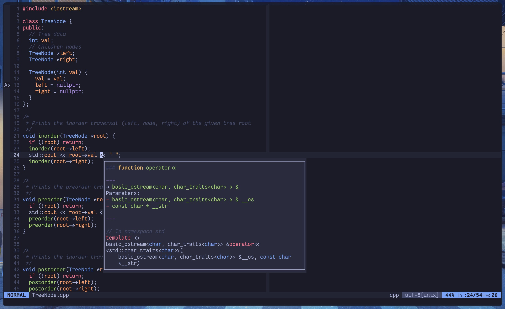

# kickstart.vim



### Introduction

Kickstart.vim is a Vimscript version of [Kickstart.nvim](https://github.com/nvim-lua/kickstart.nvim).

> Kickstart.vim is not associated with core maintainers of Kickstart.nvim. *Huge thanks to Kickstart.nvim for helping me with my (Neo)vim journey and inspiring me to create a little project like this.*

### Installation

> [!NOTE]
> I highly recommend you to [fork](https://docs.github.com/en/get-started/quickstart/fork-a-repo) this repo so that you can manage your own configuration

Option #1: Manually copying and pasting the contents of the `.vimrc`

**Option #2: Creating a symbolic link**

This is an easy way to manage your Vimrc with Git as well as other configuration files.

0. Backup your existing `.vimrc` (e.g., `mv ~/.vimrc ~/.old-vimrc.bak`)
1. clone the repository in your home directory
    ```bash
    # Replace `theopn/kickstart.vim` with `your-username/forked-repository-name` if you made a fork
    git clone https://github.com/theopn/kickstart.vim.git ~/kickstart.vim
    ```
2. Create a symbolic link between `~/kickstart.vim/.vimrc` and `~/.vimrc`
    ```bash
    # Make sure you have backed up existing .vimrc
    # The force flag (-f) will overwrite the existing file
    ln -sf ~/kickstart.vim/.vimrc ~/.vimrc
    ```
3. Now whenever you open `~/.vimrc`, you are opening `~/kickstart.vim/.vimrc`.
    Since `kickstart.vim` is a Git repository, you can easily manage changes you made to your `.vimrc` across multiple devices.

### Post Installation

Run the following command and launch Vim again, and you are ready to go!

```bash
vim +PlugInstall +qa
```

### Notable Changes Compared to Kickstart.nvim

kickstart.vim:

- is written in Vimscript (:surprised Pikachu face:) and designed for Vim >= 0.8
- **enables some settings enabled by default in Neovim (e.g., filetype, syntax, autoindent, etc.)** on the top of kickstart.nvim settings
- disables `undofile` by default, but the instructions for changing `undodir` and enabling `undofile` are included
- uses Vimscript alternatives like:
    - [vim-plug](https://github.com/junegunn/vim-plug)
    - [vim-lsp](https://github.com/prabirshrestha/vim-lsp)
    - [fzf](https://github.com/junegunn/fzf) & [fzf.vim](https://github.com/junegunn/fzf.vim)
- does not provide an alternative for:
    - highlight on yank
    - **nvim-treesitter**
- omits Lua configuration and comments irrelevant to Vim
- is overall simpler than Kickstart.nvim

The best way to understand is to read the configuration!

